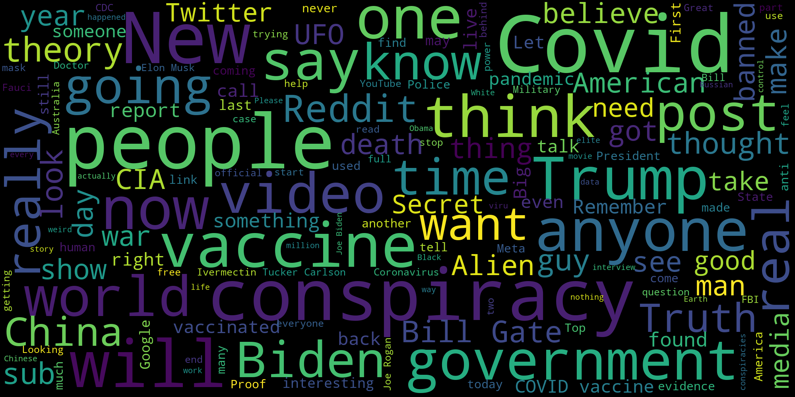
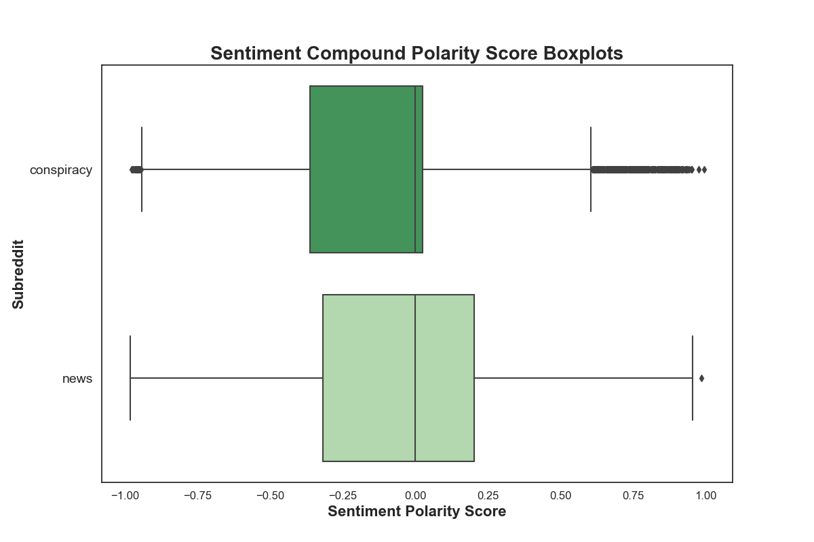
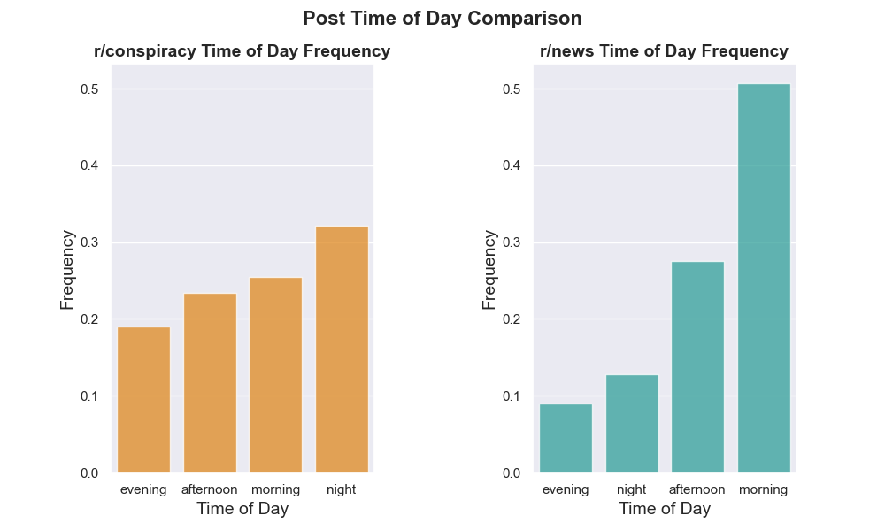
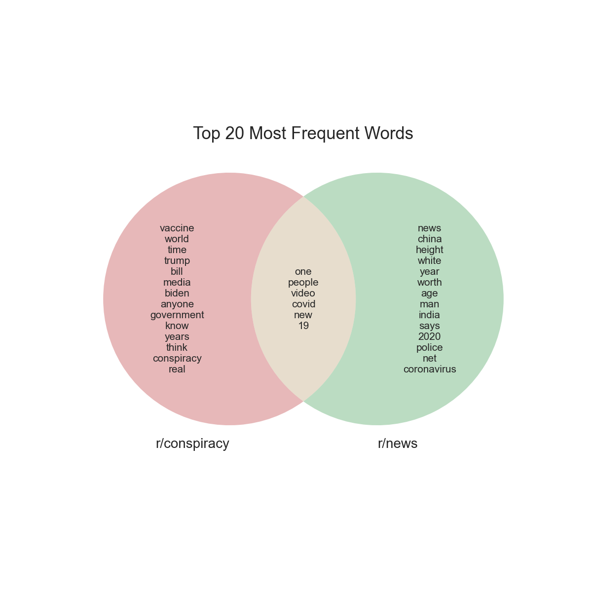

# Truth or Truth

<br/>

# Executive Summary
---
<br/>

## Project Structure
```

├── code
├── data
│   ├── cleaned_data
│   ├── reddit_conspiracy
│   │   ├── merged
│   │   └── posts
│   └── reddit_news
│       ├── merged
│       └── posts
├── images
├── model_metrics
├── presentation
└── README.md

```

## Table of Contents

- [Problem Statement](#problem_statement)
- [Methodology](#Methodology)
- [Conclusions and Recommendations](#Conclusions-and-Recommendations)
- [Sources](#Sources)


## Problem Statement<a id='problem_statement'></a>
---

The moderation teams of Reddit are overwhelmed with the vast number of posts and comments spanning its various subreddit communities. The teams in particular have trouble ensuring all posts of a given subreddit meet relevancy standards. The aim of this project is to build a model that can take text content from two different subreddits and accurately classify the origin of each piece of content. The main metrics to maximize are both the accuracy and F1 scores of the models. If successful, this model can be further improved upon to be used to classify content from any number of different subreddits across the website. This will greatly alleviate the burden of the Reddit moderation staff and open new avenues of effective moderation. The two subreddits used in this study are **r/news** and **r/conspiracy**. The four classification models constructed to solve this problem are Logistic Regression, Multinomial Naive Bayes, XGBClassifier, and Voting Classifier. 

### Background Research

Reddit is a social news aggregation and discussion website. Registered users submit content to the site which can be voted up or down by other members. Posts are organized by subject into user created boards called subreddits. Reddit administrators and subreddit moderators moderate the communities.<sup>1</sup> According to March 2023 statistics, Reddit ranks as the ninth most visited website globally and the sixth most visited website in the United States.<sup>2</sup>

#### r/news
>"The place for news articles about current events in the United States and the rest of the world." It boasts over 21 million members and is the ninth largest subreddit on the site.<sup>3</sup> 

#### r/conspiracy
>"The conspiracy subreddit is a thinking ground. Above all else, we respect everyone's opinions and ALL religious beliefs and creeds. We hope to challenge issues which have captured the public’s imagination, from JFK and UFOs to 9/11. This is a forum for free thinking, not hate speech. Respect other views and opinions, and keep an open mind. Our intentions are aimed towards a fairer, more transparent world and a better future for everyone." It boasts nearly 2 million members.<sup>4</sup>

---

## Methodology

### 1. Data Collection
> * Data was scraped from the afromentioned subreddits with the utilization of [Pushshift Reddit API](https://github.com/pushshift/api).

#### Data Sets

Origin date is April 26, 2023.

##### r/news

>* [`120d_0d.csv`](./data/reddit_news/posts/120d_0d.csv): 1000 posts up to 120 days before origin date.
>* [`240d_120d.csv`](./data/reddit_news/posts/240d_120d.csv): 1000 posts between 120-240 days before origin date.
>* [`360d_240d.csv`](./data/reddit_news/posts/360d_240d.csv): 1000 posts between 240-360 days before origin date.
>* [`480d_360d.csv`](./data/reddit_news/posts/480d_360d.csv): 1000 posts between 360-480 days before origin date.
>* [`600d_480d.csv`](./data/reddit_news/posts/600d_480d.csv): 1000 posts between 480-600 days before origin date.
>* [`720d_600d.csv`](./data/reddit_news/posts/720d_600d.csv): 1000 posts between 600-720 days before origin date.
>* [`840d_720d.csv`](./data/reddit_news/posts/840d_720d.csv): 1000 posts between 720-840 days before origin date.
>* [`960d_840d.csv`](./data/reddit_news/posts/960d_840d.csv): 1000 posts between 840-960 days before origin date.
>* [`1080d_960d.csv`](./data/reddit_news/posts/1080d_960d.csv): 1000 posts between 960-1080 days before origin date.
>* [`1200d_1080d.csv`](./data/reddit_news/posts/1200d_1080d.csv): 1000 posts between 1080-1200 days before origin date.

##### r/conspiracy

>* [`120d_0d.csv`](./data/reddit_conspiracy/posts/120d_0d.csv): 1000 posts up to 120 days before origin date.
>* [`240d_120d.csv`](./data/reddit_conspiracy/posts/240d_120d.csv): 1000 posts between 120-240 days before origin date.
>* [`360d_240d.csv`](./data/reddit_conspiracy/posts/360d_240d.csv): 1000 posts between 240-360 days before origin date.
>* [`480d_360d.csv`](./data/reddit_conspiracy/posts/480d_360d.csv): 1000 posts between 360-480 days before origin date.
>* [`600d_480d.csv`](./data/reddit_conspiracy/posts/600d_480d.csv): 1000 posts between 480-600 days before origin date.
>* [`720d_600d.csv`](./data/reddit_conspiracy/posts/720d_600d.csv): 1000 posts between 600-720 days before origin date.
>* [`840d_720d.csv`](./data/reddit_conspiracy/posts/840d_720d.csv): 1000 posts between 720-840 days before origin date.
>* [`960d_840d.csv`](./data/reddit_conspiracy/posts/960d_840d.csv): 1000 posts between 840-960 days before origin date.
>* [`1080d_960d.csv`](./data/reddit_conspiracy/posts/1080d_960d.csv): 1000 posts between 960-1080 days before origin date.
>* [`1200d_1080d.csv`](./data/reddit_conspiracy/posts/1200d_1080d.csv): 1000 posts between 1080-1200 days before origin date.

### 2. Data Cleaning and Preprocessing
> * Observations with missing content, duplicates, and foreign language results were removed.
> * HTML characters were converted to unicode. HTML links were removed. 
> * Post length, word count, sentiment score, and time of post variables were created.

### 3. Exploratory Data Analysis


> * Post length and word count distributions were analyzed. 
> * Sentiment compound polarity score distribution was examined. 



> * Time of post frequencies were visualized.



> * Frequency of n-grams was compared.



### 4. Modeling
> * Final level of preprocessing of data was applied. It contained the following features:

|       **Feature**      | **Type** |            **Dataset**           |                                **Description**                                |
|:----------------------:|:--------:|:--------------------------------:|:-----------------------------------------------------------------------------:|
| **subreddit**          | _object_ | conspiracy_news_preprocessed.csv | origin of post text from Reddit.com                                           |
| **title**              | _object_ | conspiracy_news_preprocessed.csv | content of subreddit post                                                     |
| **utc_datatime_str**   | _datetime64_ | conspiracy_news_preprocessed.csv | date and time of post creation                                                |
| **language**           | _object_ | conspiracy_news_preprocessed.csv | language of post text                                                         |
| **title_length**       |   _int_  | conspiracy_news_preprocessed.csv | number of characters in post text                                             |
| **title_word_count**   |   _int_  | conspiracy_news_preprocessed.csv | number of words in post text                                                  |
| **sentiment**          |  _float_ | conspiracy_news_preprocessed.csv | sentiment polarity score of post text                                         |
| **sentiment_category** | _object_ | conspiracy_news_preprocessed.csv | categorized polarity score (negative, neutral, postive)                       |
| **hour**               | _object_ | conspiracy_news_preprocessed.csv | categorized time of day of post creation (morning, afternoon, evening, night) |

> * Data was separated into training and testing sets.
> * Logistic Regression, Multinomial Naive Bayes, Extra Trees Classifier, XGBClassifier, Voting Classifier, and Stacking Classifier models were constructed and trained.  
> * Hyper parameters were tuned to optimize performance.
> * Results were collected, analyzed, and interpreted. 

---

## Conclusions and Recommendations

|          Model          | Training Accuracy | Testing Accuracy | Sensitivity | Specificity | Precision | Misclassification Rate | F1 Score |
|:-----------------------:|-------------------|------------------|-------------|-------------|-----------|------------------------|----------|
| Logistic Regression     | 0.892             | 0.842            | 0.826       | 0.856       | 0.818     | 0.158                  | 0.822    |
| Multinomial Naive Bayes | 0.889             | 0.848            | 0.816       | 0.872       | 0.834     | 0.152                  | 0.825    |
| XGB                     | 0.9               | 0.81             | 0.792       | 0.824       | 0.779     | 0.19                   | 0.786    |
| Vote                    | 0.902             | 0.847            | 0.829       | 0.861       | 0.824     | 0.153                  | 0.826    |


The aim of this study was to build a classification model that could distinguish text from two chosen subreddits with high accuracy. The best model appears to be the Multinomail Naives Bayes Classifier. It has the highest testing accuracy and second highest F1 score. All models appear to be overfit, however. This most likely would be the model I choose to further modify and produce for business deployment. At the moment, it would not meet the demands of the Reddit moderation team due to the need of extremely high accuracy. However, the analysis of high probability words may help the staff more quickly judge the relevancty of posts. The accuracy, F1 score, and high variance can be further corrected by judicious feature selection and engineering, hyperparameter tuning, and further data collection. Additionally, exploring other models may prove to yield even superior metrics to the Bayes Classifier.

---


## Sources

1. [Reddit - Overview](https://en.wikipedia.org/wiki/Reddit)
2. [Reddit - Traffic Statistics](https://www.semrush.com/website/reddit.com/overview/)
3. [r/news - Overview](https://www.reddit.com/r/news/)
4. [r/conspiracy - Overview](https://www.reddit.com/r/conspiracy/)
